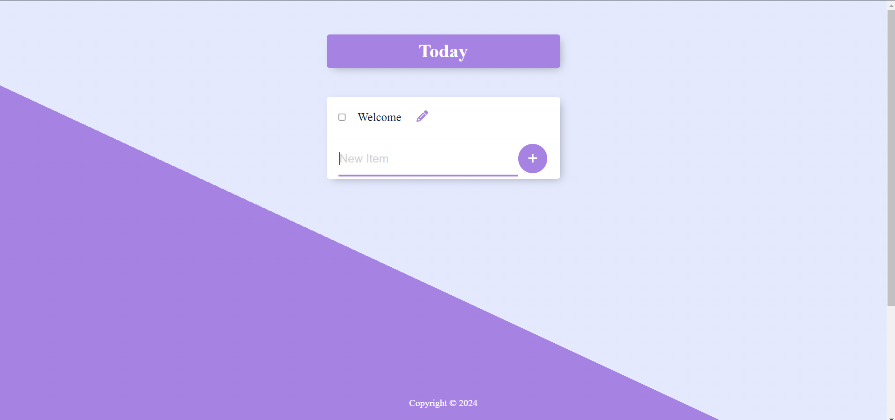

# TODO - TODO_App




## Installation Guide

### Requirements
- [Nodejs](https://nodejs.org/en/download)
- [PostgreSQL](https://www.postgresql.org/)

Both should be installed and make sure mongodb is running.
### Installation

#### First Method
```shell
git clone https://github.com/SoumadeepGhosh/Todo_Website
cd Todo_Website
```


Now install the dependencies
```shell
npm install

```
We are almost done, Now just start the development server.

For Frontend.
```shell
nodemon index.js 
```
For Backend.

Also make sure pgAdmin is running in background.

Done! Now open localhost:3000 in your browser.
